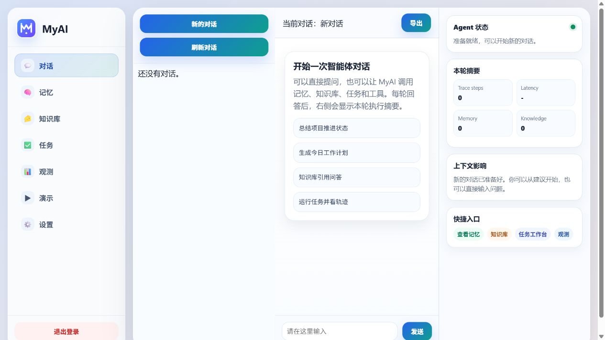

# MyAI：基于开源大模型的个人智能助手设计与实现

> **MyAI — Design and Implementation of a Personal Intelligent Assistant Based on Open-Source Large Language Models**

MyAI 是一个面向个人、本地优先的智能体应用。它以 Spring Boot 管理用户、会话、消息与 Web 界面，以 FastAPI 统一编排模型、记忆、知识库、任务和工具；默认仅监听本机回环地址，并提供可审计的运行轨迹、可复现实验和 Windows 便携 App Demo。

当前版本：**0.11.0-local**

定位：**毕业设计核心实现与工程论证已完成；当前交付物是本地单机 App Demo，不是公网多租户生产系统。**

## 项目亮点

- **真实本地开源模型**：通过 OpenAI-compatible provider 接入 Ollama、llama.cpp、vLLM、LM Studio 等本地运行时；已用 Qwen2.5 1.5B 与 BGE-M3 完成 CPU-only 基线。
- **治理型长期记忆**：记忆具有来源、置信度、作用域、敏感级别、审核状态和时间有效性；支持待确认、冲突/纠正、历史版本、引用与后台整理。
- **可引用知识库**：支持文档解析、分块、向量检索、关键词混合检索、轻量重排、引用返回、单文档问答及索引维护。
- **可恢复任务智能体**：支持规划、工具权限、超时、重试、熔断、幂等、运行时间线、后台任务及失败恢复语义。
- **统一运行时**：FastAPI lifespan 与依赖注入统一拥有 Memory、Knowledge、Task 等实例；SQLite 持久化 AgentRun/TaskRun，并建立 user → conversation → agent_run → task_run 逻辑关联。
- **工程证据闭环**：冻结模型、embedding、数据集、硬件与随机种子，完成记忆和 RAG 对比实验，记录正确率、引用命中、延迟、资源与失败率。
- **可交付 Demo**：支持一键诊断/启动/停止，并可构建带校验和、清单和包内隔离数据目录的 Windows 便携 ZIP。

## 系统架构

~~~mermaid
flowchart LR
    U["用户 / 浏览器"] --> J["Java 应用层 Spring Boot + Thymeleaf"]
    J --> JA["认证与 CSRF"]
    J --> JC["用户、会话、消息 SQLite / MySQL"]
    J --> P["Python 智能体层 FastAPI lifespan + DI"]
    P --> L["本地模型 Provider Ollama / OpenAI-compatible"]
    P --> M["治理记忆 Chroma + 元数据策略"]
    P --> K["知识库与 RAG 向量 / 混合 / 重排"]
    P --> T["任务运行时 计划、工具、恢复"]
    T --> X["只读 MCP-style 连接器"]
    P --> R["运行记录 AgentRun / TaskRun SQLite"]
    P --> O["评测与可观测性"]
~~~

Java 是认证、用户、会话归属和聊天消息的权威来源；Python 保存 Java 已校验的逻辑标识并负责智能体运行。两层数据库刻意分离，当前没有跨服务外键或级联删除。

## 技术栈

| 层次 | 主要技术 |
| --- | --- |
| Web 与应用服务 | Java 17、Spring Boot、Spring Security、Spring Data JPA、Thymeleaf |
| 智能体运行时 | Python 3.12、FastAPI、Pydantic、Uvicorn |
| 模型与向量 | OpenAI-compatible API、Ollama、Qwen2.5、BGE-M3、ChromaDB |
| 数据 | Java SQLite / 可选 MySQL、Python Runtime SQLite、包内本地文件 |
| 工程保障 | Python unittest、JUnit/Maven verify、PowerShell 质量门禁、GitHub Actions 工作流、SHA-256 清单 |

## 从原型到可交付 Demo

| 阶段 | 主要问题 | 已完成结果 |
| --- | --- | --- |
| Stage 1：安全可复现基线 | 默认暴露、Stub 回退不透明、测试数据相互污染 | 回环绑定、非回显回退、最小权限工具、隔离存储、仓库质量门禁 |
| Stage 2：毕业设计核心论证 | 缺少真实模型、固定实验条件和对比数据 | 本地模型 provider、冻结环境、记忆/RAG 消融、完整指标与校验和证据 |
| Stage 3：统一运行时 | 导入期单例、运行记录不持久、维护阻塞聊天、错误策略分散 | lifespan + DI、持久化运行关系、后台记忆维护、统一超时/熔断/退避/幂等/错误模型 |
| Stage 4：本地 App Demo | 跨电脑配置困难、前端文件过大、缺少可验证交付物 | 模块化前端、便携 ZIP、doctor/start/stop/reset、包内隔离、CI 工作流定义 |

详细结论见 [项目总体审计与最终 Checkpoint](docs/PROJECT_FINAL_AUDIT.md)。

## 毕业设计实验结果

正式证据基于 Ollama 0.32.6、Qwen2.5 1.5B Q4_K_M、BGE-M3、CPU-only 环境、固定种子 42 和合成数据集；共完成 **432/432 次有效尝试，模型/基础设施失败率 0%**。

### 记忆消融

| 方案 | 总体规则准确率 | 可回答样本准确率 | 安全拒答准确率 | 禁止证据暴露 |
| --- | ---: | ---: | ---: | ---: |
| 无记忆 | 33.33% | 0.00% | 100.00% | 0.00% |
| 基础记忆 | 50.00% | 41.67% | 66.67% | 50.00% |
| 治理记忆 | 61.11% | 41.67% | 100.00% | 5.56% |

治理记忆相对无记忆提升 27.78 个百分点，配对 bootstrap 95% CI 为 [+11.11, +50.00]；收益主要来自更好的安全拒答和证据治理，不应表述为所有事实问答都更强。

### RAG 消融

| 方案 | 总体规则准确率 | Support Hit@3 | 金标来源引用命中 | 端到端 P95 |
| --- | ---: | ---: | ---: | ---: |
| 纯向量 | 76.67% | 100.00% | 29.49% | 3171.84 ms |
| 混合检索 | 70.00% | 100.00% | 24.36% | 2607.04 ms |
| 混合 + 重排 | 70.00% | 100.00% | 30.77% | 2497.36 ms |

这组小型合成数据在 Top-3 支持召回上已经饱和，**不能据此宣称混合检索或重排优于纯向量**。主要瓶颈在小模型的证据利用和引用生成。完整协议、资源数据和负面结果见 [Stage 2 正式实验审查](docs/STAGE2_FORMAL_EXPERIMENT_REVIEW.md)。

正式实验 manifest 保留运行当时的源码 commit SHA。GitHub 公开 checkpoint
因旧本机配置凭据事件采用净化后的等价源码历史，因此公开分支的新 SHA
不会冒充正式运行所记录的原 SHA；若需要让新 SHA 与实验严格一一对应，
应在冻结的 Ollama 0.32.6 环境重新执行完整实验，而不是改写历史 manifest
或 CHECKSUMS。

## 快速启动：Stub 功能演示

支持环境：Windows 10/11 x64、Python 3.12 x64、Java 17+。首次安装 Python/Maven 依赖需要网络。

~~~powershell
git clone https://github.com/linjialiang0814/MyAI.git
cd MyAI

py -3.12 -m venv myai-python-agent\.venv
.\myai-python-agent\.venv\Scripts\python.exe -m pip install --requirement myai-python-agent\requirements.txt

.\start-myai.cmd doctor -LocalMode
.\start-myai.cmd -LocalMode
~~~

打开 http://127.0.0.1:8080；停止服务：

~~~powershell
.\start-myai.cmd stop
~~~

默认 Stub 模式可验证页面、会话、记忆、知识库、任务和 API 链路，但**不代表真实大模型效果**。更多说明见 [快速开始](docs/QUICK_START.md) 和 [故障排查](docs/TROUBLESHOOTING.md)。

## 切换到 Ollama 本地真实模型

先单独安装并启动 Ollama，再拉取模型：

~~~powershell
ollama pull qwen2.5:1.5b-instruct-q4_K_M
ollama pull bge-m3:latest
Copy-Item myai-python-agent\.env.example myai-python-agent\.env
~~~

在本机未跟踪的 **myai-python-agent/.env** 中设置：

~~~text
MYAI_LLM_PROVIDER=openai_compatible
MYAI_CHAT_PROVIDER=openai_compatible
MYAI_TASK_PROVIDER=openai_compatible
MYAI_MEMORY_PROVIDER=openai_compatible
MYAI_EMBEDDING_PROVIDER=openai_compatible
MYAI_CHAT_MODEL_ID=qwen2.5:1.5b-instruct-q4_K_M
MYAI_TASK_MODEL_ID=qwen2.5:1.5b-instruct-q4_K_M
MYAI_MEMORY_MODEL_ID=qwen2.5:1.5b-instruct-q4_K_M
MYAI_EMBEDDING_MODEL_ID=bge-m3:latest
MYAI_OPENAI_COMPATIBLE_BASE_URL=http://127.0.0.1:11434/v1
MYAI_OPENAI_COMPATIBLE_EMBEDDING_BASE_URL=http://127.0.0.1:11434/v1
MYAI_EMBEDDING_EXPECTED_DIMENSIONS=1024
MYAI_LLM_REQUEST_TIMEOUT_SECONDS=120
MYAI_EMBEDDING_REQUEST_TIMEOUT_SECONDS=60
MYAI_LLM_MAX_RETRIES=0
MYAI_EMBEDDING_MAX_RETRIES=0
MYAI_LLM_FALLBACK_TO_STUB=false
~~~

重新启动 MyAI 后，在“设置 → 系统健康”执行真实模型探测。不要提交 **.env**、模型权重、数据库或日志。更完整配置见 [配置参考](docs/CONFIGURATION_REFERENCE.md)。

## Windows 便携 App Demo

可直接从 [GitHub Release v0.11.0-local](https://github.com/linjialiang0814/MyAI/releases/tag/v0.11.0-local)
下载 Windows ZIP 与配套 SHA-256 文件。下载后应先核对校验和，再解压到长度不超过 100 个字符的本地目录。

构建并校验：

~~~powershell
.\scripts\build-portable.ps1 -OutputDirectory .\dist
.\scripts\verify-portable.ps1 -ArtifactPath .\dist\MyAI-0.11.0-local-windows-x64.zip
~~~

在另一台电脑解压后：

~~~powershell
.\setup.cmd
.\doctor.cmd
.\start.cmd
~~~

便携包不内置 Python、JRE、Ollama 或模型权重；它提供校验清单、包内虚拟环境和数据目录、随机本地密码以及安全的启动/停止/重置控制。详见 [Windows 便携版说明](docs/PORTABLE_APP.md)。

## 本地验证

~~~powershell
.\scripts\ci-quality-gates.ps1

cd myai-python-agent
.\.venv\Scripts\python.exe -m unittest discover -s tests -t . -p "test_*.py"

cd ..\myai-java-service
.\mvnw.cmd --batch-mode --no-transfer-progress verify
~~~

仓库已定义 [Windows GitHub Actions 工作流](.github/workflows/ci.yml)。README 只陈述本地已记录的验证结果；远端是否通过应以对应提交的 Actions 页面为准。

## 已知边界

- 当前支持单个 Python 应用 worker；队列、锁和维护调度不是分布式实现。
- Python Agent API 未对不可信客户端独立认证，Java 与 Python 都不得直接暴露到公网。
- SQLite、向量库、日志与上传文档默认未加密，安全边界包含本机账户与文件权限。
- 超时是协作式预算，无法强制终止已进入阻塞依赖的线程。
- 当前连接器是受策略约束的只读 MCP-style 基线，不是完整标准 MCP 客户端。
- 便携包不是 MSI/MSIX、无数字签名，也不是完全离线发行包。
- 仓库当前未附开源许可证；“基于开源大模型”描述模型技术路线，不等于仓库代码已获得开源授权。

完整列表见 [已知限制](docs/KNOWN_LIMITATIONS.md) 和 [安全策略](SECURITY.md)。

## 文档导航

- [文档索引](docs/README.md)
- [项目总体审计与最终 Checkpoint](docs/PROJECT_FINAL_AUDIT.md)
- [架构概览](docs/ARCHITECTURE_OVERVIEW.md)
- [功能指南](docs/FEATURE_GUIDE.md)
- [Stage 2 实验审查](docs/STAGE2_FORMAL_EXPERIMENT_REVIEW.md)
- [Stage 3 统一运行时收尾](docs/UPGRADE_STAGE3_UNIFIED_RUNTIME_CLOSEOUT.md)
- [Stage 4 便携 App 收尾](docs/UPGRADE_STAGE4_PORTABLE_APP_BASELINE_CLOSEOUT.md)
- [发布说明](docs/RELEASE_NOTES.md)
- [贡献指南](CONTRIBUTING.md)
- [安全策略](SECURITY.md)

## 展示素材

README 已包含不含个人数据的合成账户截图。若用于求职或毕业答辩，建议再提供一段 **60–90 秒演示视频**：依次展示真实模型健康探测、带执行轨迹的对话、知识库引用、记忆审核、任务时间线和便携启动。录制前请使用合成数据并隐藏桌面路径、账户名、令牌与本地日志；视频是展示增强项，不是项目可运行性的前置条件。
