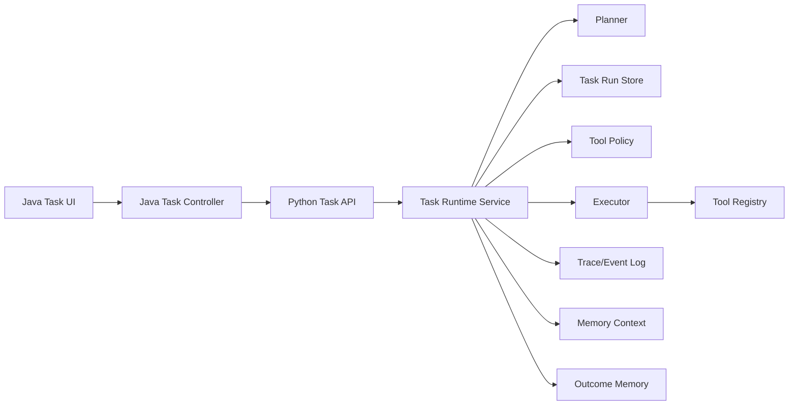

# Phase 3 Plan: Agent Runtime And Task System 2.0

## Goal

Move MyAI from "can execute a tool task once" to "can manage agent work as a reliable runtime".

Phase 1 made execution trace visible. Phase 2 upgraded memory governance. Phase 3 should connect those capabilities into the task module: every task should have clear state, auditable steps, controlled tool execution, recoverable failures, and a path toward longer-running agent workflows.

The first principle is still MVP-first: keep the existing `/task` synchronous experience working, then add runtime structure around it without forcing a full rewrite.

## Current Baseline

The current task module already has useful foundations:

- Python endpoint:
  - `POST /task`
  - accepts `user_id` and `content`
  - returns `content`, `plan`, `result`, `reward`, `success`, `error`, `latency_ms`
- Planning:
  - rule-based planner
  - multi-step rule planner
  - optional LLM fallback planner
  - recovery planner wrapper
- Execution:
  - sequential step execution
  - tool argument validation through Pydantic
  - simple context passing between steps
  - structured `ToolResult`
- Tools:
  - calculator
  - datetime
  - system info
  - text stats
  - weather
  - web search
  - file summary
  - memory admin
- Stats:
  - decision records
  - basic reward/success-rate tracking
- Java frontend:
  - `/task` proxy endpoint
  - simple task execution panel
  - step result rendering

Main limitations:

- Task execution is currently request-bound and synchronous.
- There is no durable task run identity or task state machine.
- Tool permissions and risk controls are implicit.
- Step retry, cancellation, pause/resume, and background execution are not first-class.
- Task results are visible, but not yet a full runtime timeline.
- Task execution does not yet use memory as an intentional planning/execution signal.
- Task outcomes are not yet summarized back into memory as reusable experience.

## Target Architecture

Phase 3 should introduce a clearer runtime boundary:

The core new concepts:

- `TaskRun`: one user-visible task execution.
- `TaskStepRun`: one planned/executed step within a run.
- `TaskState`: lifecycle status for a run.
- `TaskEvent`: append-only timeline event for planning, permission, execution, retry, failure, cancellation, and completion.
- `ToolPolicy`: risk, permission, timeout, and retry rules per tool.
- `RuntimeContext`: structured context shared by planner, executor, memory retrieval, and trace.

## Phase 3 Increments

### 3.1 Task Runtime State Machine MVP

Purpose: give every task a stable identity and lifecycle without breaking the current synchronous `/task` flow.

Status: baseline implemented.

Add:

- `task_run_id`
- `status`
  - `queued`
  - `planning`
  - `running`
  - `succeeded`
  - `failed`
  - `cancelled`
- `created_at`
- `started_at`
- `finished_at`
- `current_step_id`
- `user_id`
- `content`
- `plan`
- `result`
- `error`

Implementation notes:

- Start with an in-memory store or lightweight JSON/SQLite store depending on current local persistence direction.
- Keep `POST /task` synchronous, but internally create and update a `TaskRun`.
- Return `task_run_id` in Python and Java responses.
- Add `GET /task/runs/{task_run_id}` for inspection.
- Add focused tests for successful, failed, and no-tool runs.

Acceptance criteria:

- Existing task UI still works.
- Every task response includes a run id and final status.
- A run can be fetched after execution.
- Failed tool steps mark the run as `failed` with an explainable error.

Implemented baseline:

- Added in-memory `TaskRunStore`.
- Added `TaskRun` and `TaskStepRun` runtime models.
- Existing synchronous `POST /task` now creates a run internally.
- Task lifecycle now moves through:
  - `queued`
  - `planning`
  - `running`
  - `succeeded` or `failed`
- Python task responses now include:
  - `task_run_id`
  - `status`
- Added run lookup:
  - Python: `GET /task/runs/{task_run_id}`
  - Java proxy: `GET /task/runs/{taskRunId}`
- Java `TaskResponse` now accepts `task_run_id` and `status`.
- Java task UI displays run id and status in the existing result panel.
- Added tests for:
  - fetching a completed synchronous run
  - marking a missing-tool step as failed

### 3.2 Runtime Event Timeline And Trace Unification

Purpose: make task execution observable as a timeline, not only a final blob.

Status: baseline implemented.

Add task events:

- `task.created`
- `task.planning.started`
- `task.planning.completed`
- `task.step.started`
- `task.step.completed`
- `task.step.failed`
- `task.completed`
- `task.failed`

Implementation notes:

- Store events on `TaskRun`.
- Reuse or align with the Phase 1 trace vocabulary where possible.
- Expose `events` from `GET /task/runs/{task_run_id}`.
- Add frontend timeline rendering in the task panel.
- Keep the first UI compact: status, step, tool, latency, error/result summary.

Acceptance criteria:

- Users can see what happened during a task.
- Timeline is stable enough to support future background polling.
- Existing chat trace and task timeline share similar naming conventions.

Implemented baseline:

- Added append-only `TaskEvent` runtime records.
- `TaskRun` now exposes top-level `events`.
- `TaskStepRun` now carries step-local events.
- Baseline event types:
  - `task.created`
  - `task.planning.started`
  - `task.planning.completed`
  - `task.running`
  - `task.step.started`
  - `task.step.completed`
  - `task.step.failed`
  - `task.completed`
  - `task.failed`
- Python `/task` responses include `events`.
- `GET /task/runs/{task_run_id}` returns the same event timeline.
- Java `TaskResponse` accepts `events`.
- Java task UI renders a compact execution timeline.
- Added tests for successful and failed task runtime event sequences.

### 3.3 Tool Policy And Permission Governance

Purpose: make tool execution production-shaped by separating "can plan this tool" from "may execute this tool now".

Status: baseline implemented.

Add `ToolPolicy` metadata:

- risk level:
  - `safe`
  - `network`
  - `filesystem`
  - `sensitive`
  - `destructive`
- default timeout
- retry policy
- confirmation requirement
- allowed in local mode
- allowed in hosted mode

Initial policy suggestions:

- `calculator`, `datetime`, `text_stats`: safe, no confirmation.
- `system_info`: safe/local, no confirmation.
- `weather`, `web_search`: network, may need availability handling.
- `file_summary`: filesystem/read, user-scoped.
- `memory_admin`: sensitive, confirmation for maintenance/update settings when exposed to users.

Implementation notes:

- Add policy fields to tool registration or a separate policy registry.
- Executor checks policy before running a tool.
- Add `permission_required` status for future async flow.
- In MVP, synchronous `/task` can fail closed with a clear message when confirmation is required.

Acceptance criteria:

- Each tool has an explicit policy.
- High-risk tools are not executed silently.
- Policy decisions appear in task events.

Implemented baseline:

- Added `ToolPolicy` to the task tool base layer.
- Policies include:
  - `risk_level`
  - `timeout_seconds`
  - `retry_count`
  - `requires_confirmation`
  - `allowed_in_local`
  - `allowed_in_hosted`
- `ToolExecutor` now checks policy after argument validation and before execution.
- Tools with `requires_confirmation=true` fail closed when no confirmation is present.
- Tool results include policy metadata:
  - `tool_policy`
  - `policy_decision`
  - `permission_required` when applicable
- Task runtime emits policy events:
  - `task.tool_policy.allowed`
  - `task.tool_policy.permission_required`
  - `task.tool_policy.blocked`
- Added baseline policies for:
  - safe tools
  - network tools
  - filesystem/read tools
  - sensitive memory-admin workflows
- `memory_admin` requires confirmation for:
  - `maintenance`
  - `update_settings`
- Query/report style memory-admin workflows remain executable.
- Added regression coverage for allowed and confirmation-required policy decisions.

Next follow-up:

- Add an explicit confirmation API and UI flow instead of returning failure for `permission_required`.
- Enforce timeout and retry fields in the executor.
- Expand policy metadata in tool/workflow inspection reports.

### 3.4 Retry, Timeout, And Recovery

Purpose: turn task failure from a dead end into a governed runtime outcome.

Status: baseline implemented.

Add:

- per-tool timeout
- retry count
- retryable error classification
- step-level failure metadata
- recovery recommendation

Implementation notes:

- Start with deterministic retry for transient network-like failures.
- Avoid aggressive reconnect/retry loops; wait for network stability when reconnecting issues appear.
- Add `attempt` to step events.
- Keep retries disabled for tools marked sensitive or destructive unless explicitly allowed.

Acceptance criteria:

- Retryable failures are retried within policy limits.
- Non-retryable failures fail quickly with a clear event.
- Task result explains whether recovery was attempted.

Implemented baseline:

- `ToolExecutor` now applies `ToolPolicy.timeout_seconds`.
- `ToolExecutor` now applies `ToolPolicy.retry_count`.
- Timeout is enforced with a local executor-level future timeout.
- Retry is conservative:
  - disabled for sensitive/destructive risk levels
  - enabled only when the error looks transient, such as timeout, connection, network, rate limit, or 5xx-style failures
- Tool result metadata now includes:
  - `attempt`
  - `max_attempts`
  - `retry_count`
  - `timeout_seconds`
  - `retryable`
  - `recovery_attempted`
  - `recovery_status`
  - `recovery_recommendation`
  - `errors`
- Task runtime emits:
  - `task.step.recovery`
- Added tests for:
  - retryable first failure that succeeds on retry
  - timeout failure with recovery recommendation

Next follow-up:

- Add richer retry events for every attempt when background execution lands.
- Add cancellation-aware timeout behavior in 3.5 background mode.
- Consider per-risk retry backoff once tool execution becomes async/backgrounded.

### 3.5 Background Task Mode

Purpose: support longer tasks without tying execution to a single HTTP request.

Status: baseline implemented.

Add endpoints:

- `POST /task/runs`
  - creates a run and returns immediately.
- `GET /task/runs/{task_run_id}`
  - returns state, result, and events.
- `POST /task/runs/{task_run_id}/cancel`
  - requests cancellation.

Implementation notes:

- Start with a local worker thread or asyncio task queue.
- Keep one-process local development simple.
- Persist enough state to survive frontend refresh.
- Add polling in Java frontend.

Acceptance criteria:

- User can start a task and leave the page.
- Task progress can be polled.
- Cancellation works between steps.

Implemented baseline:

- Added local background execution through a small Python worker pool.
- Added Python endpoints:
  - `POST /task/runs`
  - `GET /task/runs/{task_run_id}`
  - `POST /task/runs/{task_run_id}/cancel`
- Existing synchronous `POST /task` remains unchanged.
- `TaskRun` now supports:
  - `cancel_requested`
  - `task.queued`
  - `task.cancel_requested`
  - `task.cancelled`
- Cancellation is cooperative:
  - cancellation requests are recorded immediately
  - currently running tool calls are not force-killed
  - execution stops before the next step
- Added Java proxy endpoints for background start, lookup, and cancel.
- Java task panel now supports:
  - background execution
  - polling task status
  - cancelling a background task
  - rendering the run snapshot and timeline
- Added tests for:
  - background task start and fetch
  - cancellation between steps

Next follow-up:

- Persist task runs if background tasks need to survive Python process restarts.
- Add richer task list/history UI in 3.6.
- Add stronger cancellation semantics for async-aware tools in a later increment.

### 3.6 Task UI 2.0

Purpose: make task execution understandable and controllable from the Java frontend.

Status: baseline implemented.

Add UI elements:

- task run list
- current task status
- timeline panel
- step cards
- retry/cancel buttons where supported
- permission confirmation card for gated tools
- result summary and raw details toggle

Design direction:

- Operational, compact, scan-friendly.
- Avoid a marketing-style page.
- Prefer timeline/status controls over decorative cards.

Acceptance criteria:

- A user can inspect a task without reading JSON.
- Failures and pending confirmations are visually clear.
- Existing quick task execution remains easy.

Implemented baseline:

- Added task run list support:
  - Python: `GET /task/runs`
  - Java proxy: `GET /task/runs`
- Upgraded the Java task page into a compact task workbench.
- The workbench includes:
  - quick synchronous execution
  - background execution
  - background cancellation
  - recent run list
  - selected run detail panel
  - status pills
  - run summary fields
  - step cards
  - execution timeline
  - result summary and raw details toggle
- Synchronous task execution now refreshes the selected run snapshot through the run lookup API.
- Background task polling updates both the detail panel and recent run list.
- Added regression coverage for listing user-scoped task runs.

Next follow-up:

- Add richer permission confirmation UI when `permission_required` appears.
- Add retry action buttons after retry/cancel APIs exist.
- Consider persisted task run history if users need process-restart durability.

### 3.7 Memory-Aware Task Planning

Purpose: use the completed memory governance system to make task execution more personalized and consistent.

Status: baseline implemented.

Add:

- memory retrieval before planning for relevant tasks
- retrieved memory citations in task plan metadata
- memory-aware tool argument preparation
- policy to avoid using pending, hidden, disabled, or low-quality memories

Implementation notes:

- Reuse Phase 2 retrieval policy and explanations.
- Keep memory context small and auditable.
- Add events:
  - `task.memory_retrieval.started`
  - `task.memory_retrieval.completed`

Acceptance criteria:

- Task planning can cite the memories it used.
- Hidden or disabled memories do not affect tasks.
- The task timeline shows memory retrieval decisions.

Implemented baseline:

- Task runtime retrieves memory context before planner execution when `user_id` and memory service are available.
- Reused Phase 2 retrieval explanations through `retrieve_for_context_with_explanation`.
- Planner short context now receives compact memory summaries.
- Task plan metadata now includes:
  - `memory_context.selected`
  - `memory_context.short_context`
  - `memory_context.explanations`
- Task timeline now emits:
  - `task.memory_retrieval.started`
  - `task.memory_retrieval.completed`
- Default task service now shares one `MemoryService` between memory-aware planning and `memory_admin`.
- Java task workbench displays planning memory citations in the selected task detail.
- Added regression coverage for memory-aware planning citations and events.

### 3.8 Outcome Memory And Task Experience

Purpose: let useful task outcomes become future context without blindly storing every result.

Status: baseline implemented.

Potential memories:

- user decisions made during a task
- stable preferences discovered through task execution
- durable project facts
- recurring task patterns
- tool failure preferences, such as "do not use web search for this project"

Implementation notes:

- Route all task-derived memory candidates through existing memory governance.
- Use source such as `task_outcome`.
- Include `source_ref` pointing to `task_run_id` and `step_id`.
- Default to pending for inferred or low-confidence task outcome memories.

Acceptance criteria:

- Task outcome memories are auditable.
- Source references link back to task runs.
- User can reject or edit task-derived memories before acceptance when needed.

Implemented baseline:

- Added governed task outcome memory writing through `MemoryService.process_task_outcome`.
- Outcome memories use source `task_outcome`.
- Source references now support:
  - `task_run_id`
  - `step_id`
- Task runtime now emits:
  - `task.outcome_memory.started`
  - `task.outcome_memory.completed`
- Tool-backed successful tasks can create pending `task_workflow` memories.
- Failed tool steps can create pending `tool_failure` memories.
- No-tool and cancelled tasks do not write outcome memories in the MVP.
- Java task workbench displays the outcome memory write result in task details.
- Added regression coverage for pending outcome memory, source reference, and runtime events.

### 3.9 Workflow Registry

Purpose: move from ad hoc tool selection toward reusable agent workflows.

Status: baseline implemented.

Add workflow definitions for recurring patterns:

- memory maintenance
- memory eval/report
- knowledge file summary
- project status inspection
- environment diagnostics

Each workflow should define:

- name
- description
- required tools
- parameters
- default plan
- permission policy
- output schema

Acceptance criteria:

- Common multi-step tasks can be invoked consistently.
- Workflow definitions are inspectable.
- Task planner can choose a workflow before falling back to generic tool planning.

Implemented baseline:

- Added `WorkflowDefinition`, `WorkflowStepTemplate`, and `WorkflowRegistry`.
- Added default workflow definitions for:
  - memory policy inspection
  - memory eval report
  - memory maintenance
  - knowledge file summary
  - environment diagnostics
- `ToolPlanner` now checks workflow registry before multi-step/rule/LLM planning.
- Workflow-based plans use `source="workflow"` and include `plan.workflow` metadata.
- Added Python inspection endpoint:
  - `GET /task/workflows`
- Added Java proxy endpoint:
  - `GET /task/workflows`
- Added regression coverage for workflow inspection and workflow-based planning.

### 3.10 Runtime Evaluation And Reports

Purpose: make task runtime behavior measurable.

Status: baseline implemented.

Add eval fixtures for:

- no-tool task
- single safe tool task
- multi-step chained task
- invalid tool args
- tool failure
- permission required
- retryable failure
- memory-aware planning

Add reports for:

- plan accuracy
- tool success rate
- average latency
- retry count
- failure reasons
- permission denials

Acceptance criteria:

- Runtime changes can be regression-tested.
- Reports show whether policy changes improve or degrade behavior.

Implemented baseline:

- Added task runtime eval fixture:
  - `tests/fixtures/task_runtime_eval.json`
- Added local report runner:
  - `python -m app.task.evaluation.runtime_report --format markdown --strict`
- Fixture coverage includes:
  - no-tool task
  - single safe tool task
  - multi-step chained task
  - invalid tool args
  - permission required
  - retryable failure recovered by retry
  - memory-aware planning
- Report output includes:
  - total/pass/fail/pass rate
  - per-case status, plan source, tools, latency, and errors
  - tool calls, success rate, and average latency
- `StatsManager` now tracks `workflow_hits` separately from no-tool hits.
- Added regression coverage for default fixture pass/fail and Markdown rendering.

## Recommended Build Order

1. 3.1 Task Runtime State Machine MVP
2. 3.2 Runtime Event Timeline And Trace Unification
3. 3.3 Tool Policy And Permission Governance
4. 3.6 Task UI 2.0, first compact version
5. 3.4 Retry, Timeout, And Recovery
6. 3.5 Background Task Mode
7. 3.7 Memory-Aware Task Planning
8. 3.8 Outcome Memory And Task Experience
9. 3.9 Workflow Registry
10. 3.10 Runtime Evaluation And Reports

Reasoning:

- The state machine is the foundation.
- Timeline makes every later feature observable.
- Tool policy should arrive before background or higher-autonomy execution.
- UI should become useful early, after the backend has a stable run/event model.
- Memory-aware planning is more valuable once task runs and citations are inspectable.

## MVP Scope For The Next Increment

The most valuable immediate task is 3.1.

MVP deliverables:

- Python `TaskRun` and `TaskStepRun` models.
- In-memory `TaskRunStore`.
- Internal state transitions inside existing `TaskService.handle_task`.
- `task_run_id` and `status` in Python task response.
- Java DTO support for `task_run_id` and `status`.
- `GET /task/runs/{task_run_id}` endpoint.
- Minimal Java proxy endpoint for run lookup.
- Tests for:
  - successful single-tool run
  - failed tool run
  - no-tool run
  - run lookup

Out of scope for the MVP:

- background execution
- cancellation
- permission confirmation UI
- persistent task history
- workflow registry
- memory outcome writing

## Engineering Notes

- Keep the existing synchronous task endpoint stable.
- Add runtime structure with minimal behavioral change first.
- Prefer structured event/state objects over free-form strings.
- Keep task persistence replaceable; do not overcommit to a database schema before the runtime model is proven.
- Tool policy should fail closed for high-risk operations.
- Retrying must be conservative, especially around reconnecting/network instability.
- Every new runtime feature should be visible in either the task response, run lookup, or frontend timeline.

## Open Questions

- Should the first `TaskRunStore` be in-memory, JSON-backed, or SQLite-backed?
- Should task run history be scoped per user only, or also per conversation/project?
- How long should completed local task runs be retained?
- Which tools should require explicit confirmation in local mode?
- Should background task execution be Python-only first, or coordinated by the Java service?
- Should task timeline events later be shared with the Phase 1 chat trace model?

## Definition Of Phase 3 Done

Phase 3 can be considered complete when:

- Tasks have durable run ids and inspectable lifecycle state.
- Task execution has an event timeline visible in the frontend.
- Tool execution is governed by explicit policy.
- Failures, retries, and permission denials are explainable.
- Long-running tasks can run outside a single request.
- Memory can be used and cited during task planning.
- Important task outcomes can enter memory through governance.
- A small eval/report fixture protects the runtime behavior.
