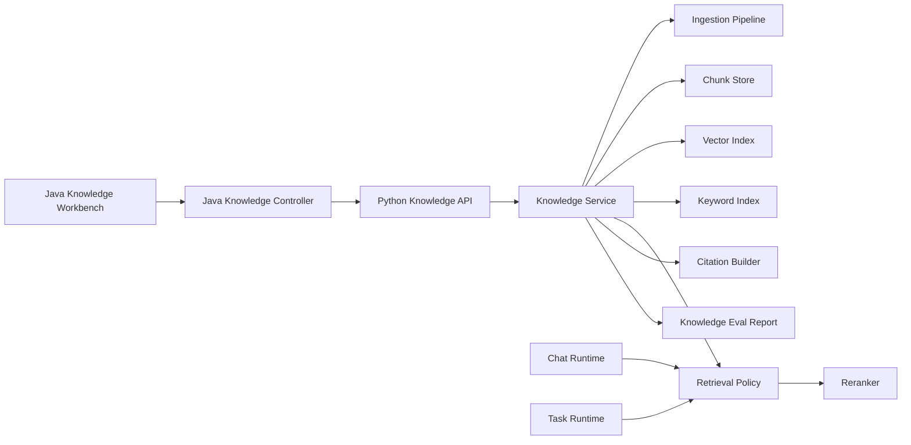

# Phase 4 Plan: Knowledge Workbench And RAG Governance

## Goal

Move MyAI's knowledge base from "upload files and retrieve chunks" to a usable personal research and document workbench.

Phase 2 made memory governable. Phase 3 made tasks observable and repeatable. Phase 4 should make personal documents trustworthy enough to support real work: ingestion should be explainable, retrieval should be auditable, answers should cite sources, and the user should be able to inspect, maintain, and evaluate the knowledge base.

The MVP principle still applies: keep the current upload/query/chat integration working, then add structure around it.

## Current Baseline

The current knowledge module already has a working foundation:

- Python backend:
  - `POST /knowledge/upload`
  - `POST /knowledge/query`
  - `GET /knowledge/files/{user_id}`
  - `DELETE /knowledge/files/{user_id}/{file_id}`
- File support:
  - `.txt`
  - `.pdf`
  - `.docx`
- Ingestion:
  - text extraction
  - paragraph-aware chunking with overlap
  - vector embedding
  - ChromaDB storage
  - per-user file index JSON
- Retrieval:
  - vector query
  - optional file filter
  - top-k chunks with score
- Chat integration:
  - retrieves snippets for prompt context
  - records `knowledge.retrieve` trace step
- Task integration:
  - `file_summary` tool
  - `knowledge_file_summary` workflow
- Java frontend:
  - upload panel
  - file list
  - query panel
  - result cards

Main limitations:

- File/chunk metadata is minimal.
- PDF page references are not preserved.
- Retrieval is vector-only, with no keyword fallback or reranking.
- Query results show chunks, but citation quality is still basic.
- Chat answers can use knowledge snippets, but final answers do not yet cite sources clearly.
- File summaries are extractive/truncated, not structured.
- There is no ingestion health report or knowledge eval fixture.
- There is no document-focused reading/QA workspace.
- Knowledge maintenance is limited to deleting whole files.

## Target Architecture

Core concepts to introduce:

- `KnowledgeFile`: durable file-level metadata.
- `KnowledgeChunk`: chunk-level metadata and source span.
- `KnowledgeCitation`: file, chunk, page, section, score, and quote/snippet.
- `IngestionReport`: parse/chunk/index status and warnings.
- `RetrievalExplanation`: selected/filtered hits with scoring factors.
- `DocumentProfile`: structured summary, keywords, outline, and detected entities.
- `KnowledgeEvalCase`: repeatable retrieval/QA regression case.

## Phase 4 Increments

### 4.1 Knowledge Metadata And Ingestion Report

Purpose: make uploaded documents inspectable and ingestion failures understandable.

Status: baseline implemented.

Add file metadata:

- `file_id`
- `file_name`
- `file_type`
- `size_bytes`
- `content_hash`
- `uploaded_at`
- `parser`
- `parser_version`
- `text_length`
- `chunk_count`
- `embedding_provider`
- `embedding_model`
- `ingestion_status`
- `ingestion_warnings`

Add chunk metadata:

- `chunk_id`
- `file_id`
- `chunk_index`
- `char_start`
- `char_end`
- `page_start`
- `page_end`
- `section_title`
- `token_estimate`

Implementation notes:

- Keep the current JSON index for MVP, but normalize the structure.
- Compute `content_hash` to detect duplicate uploads.
- Return an `ingestion_report` from upload.
- Add tests for upload metadata, duplicate detection, and parser warnings.

Acceptance criteria:

- Uploaded files expose parse/chunk/index status.
- Users can tell why a document produced few or no chunks.
- Duplicate upload can be detected before polluting the index.

Implemented baseline:

- Added file-level metadata:
  - `size_bytes`
  - `content_hash`
  - `parser`
  - `parser_version`
  - `text_length`
  - `embedding_provider`
  - `embedding_model`
  - `ingestion_status`
  - `ingestion_warnings`
- Added upload `ingestion_report`.
- Added duplicate upload detection by SHA-256 content hash.
- Added chunk span metadata:
  - `char_start`
  - `char_end`
  - `page_start`
  - `page_end`
  - `section_title`
  - `token_estimate`
- Kept `chunk_text()` backward compatible and added span-aware chunking.
- Query hits now include chunk source span fields.
- Java DTOs accept the new metadata.
- Knowledge upload result and file cards show ingestion status and file size.
- Added regression coverage for ingestion report, list metadata, duplicate detection, and chunk spans.

### 4.2 Citation-First Query Results

Purpose: make every retrieved chunk traceable back to a document location.

Status: baseline implemented.

Add:

- citation object in query response
- stable source labels
- snippet preview
- file-scoped citation links for frontend display

Citation fields:

- `citation_id`
- `file_id`
- `file_name`
- `chunk_id`
- `chunk_index`
- `page_start`
- `page_end`
- `section_title`
- `score`
- `snippet`

Implementation notes:

- For `.txt` and `.docx`, page can be empty but section/char span should still work.
- For PDFs, preserve page number during extraction.
- Chat trace should carry citations instead of plain strings where possible.

Acceptance criteria:

- Knowledge query cards show file, chunk/page, score, and snippet.
- Chat trace can explain which knowledge citations entered prompt context.

Implemented baseline:

- Query hits now include top-level `citation_id` and `snippet`.
- Query hits include a nested `citation` object with file, chunk, span, page, score, content hash, token estimate, and snippet metadata.
- Java knowledge query DTO accepts citation fields.
- Frontend query cards now display citation id, source label, similarity, snippet, and a collapsible raw chunk.
- Added regression coverage for citation payload consistency.

### 4.3 Hybrid Retrieval MVP

Purpose: improve recall for exact terms, filenames, acronyms, and Chinese/English mixed queries.

Status: baseline implemented.

Add first-stage retrieval:

- vector retrieval
- keyword retrieval
- filename/title boost
- optional file filter

Add scoring factors:

- vector similarity
- keyword overlap
- filename match
- recency boost
- file filter boost

Implementation notes:

- Start with an in-process keyword index built from stored chunks.
- Persisting a full BM25 index can wait.
- Keep score formula simple and explainable.

Acceptance criteria:

- Exact keyword queries can retrieve relevant chunks even when embeddings are weak.
- Result explanations show why each hit was selected.

Implemented baseline:

- Query now builds a hybrid candidate pool from:
  - vector retrieval
  - in-process keyword retrieval over stored chunks
- Keyword retrieval is scoped by user and optional file filter.
- Added a simple explainable fusion score with:
  - vector score
  - keyword score
  - filename score
  - recency score
  - file filter score
- Query hits expose:
  - `retrieval_mode`
  - `retrieval_score`
  - factor scores
  - `retrieval_explanation`
- Java DTOs accept retrieval explanation fields.
- Frontend query cards show retrieval score, mode, factor scores, and selection reason.
- Added regression coverage for exact-keyword fallback when `top_k=1`.

### 4.4 Reranking And Retrieval Policy

Purpose: separate candidate retrieval from final context selection.

Status: baseline implemented.

Add:

- top-N candidate retrieval
- deterministic reranker baseline
- diversity by file/chunk
- max context budget
- selected vs filtered explanations

Reranker signals:

- hybrid score
- query term coverage
- chunk length quality
- duplicate/near-duplicate penalty
- same-file diversity
- page/section proximity

Acceptance criteria:

- Final selected context is smaller and better explained.
- Repeated adjacent chunks do not crowd out other useful documents.

Implemented baseline:

- Split query processing into:
  - candidate retrieval
  - candidate hit construction
  - final selection
- Candidate retrieval now over-fetches top-N vector candidates and merges keyword candidates.
- Added deterministic rerank scoring with:
  - hybrid retrieval score
  - query term coverage
  - chunk length quality
  - duplicate penalty
  - same-file diversity penalty
- Added final selection policy with:
  - max context token budget
  - max chunks per file
  - relaxed fallback when diversity would under-fill results
- Query hits expose:
  - `candidate_rank`
  - `final_rank`
  - `rerank_score`
  - `query_coverage`
  - `length_quality`
  - duplicate/diversity penalties
  - `selection_status`
  - `selection_reason`
  - `selection_explanation`
- Frontend query cards show final rank, rerank score, selection reason, and rerank factors.
- Added regression coverage for selection metadata and same-file diversity.

### 4.5 Structured Document Summary

Purpose: make uploaded documents useful before the user asks a query.

Status: baseline implemented.

Add document profile:

- short summary
- outline
- keywords
- detected topics
- important passages
- possible questions
- document language

Implementation notes:

- Baseline can be deterministic/extractive.
- Add optional LLM summary later behind env flags.
- Store profile in file index.

Acceptance criteria:

- File cards show useful structured metadata.
- File summary tool returns structured summary rather than only truncated text.

Implemented baseline:

- Added deterministic `document_profile` generation during upload.
- Profile fields include:
  - `title`
  - `short_summary`
  - `outline`
  - `keywords`
  - `detected_topics`
  - `important_passages`
  - `possible_questions`
  - `document_language`
  - `stats`
  - `summary_method`
- Kept the existing `summary` field backward compatible by deriving it from `document_profile.short_summary`.
- File listing and duplicate upload responses expose `document_profile`.
- File summary tool now returns `document_profile`, `outline`, possible questions, and document language.
- File summary tool can build a profile on read for legacy index entries without stored profile metadata.
- Frontend upload results and file cards show a collapsible document profile panel.
- Added regression coverage for upload/list/duplicate profile fields and structured file summary tool output.

### 4.6 Document QA Mode

Purpose: support focused work on one document or a selected set of documents.

Status: baseline implemented.

Add:

- document-scoped query mode
- selected file set
- "ask this document" frontend workflow
- answer with citations
- fallback when answer is not found in selected documents

Implementation notes:

- Reuse retrieval policy with mandatory file filter.
- Make "not enough evidence" a first-class answer state.

Acceptance criteria:

- User can query one file without unrelated knowledge leaking in.
- Answers clearly cite selected document evidence.

Implemented baseline:

- Added document-scoped QA API:
  - Python `POST /knowledge/qa`
  - Java proxy `POST /knowledge/qa`
- QA requests require a selected `file_id`.
- QA reuses the existing hybrid retrieval, citation, and rerank policy with a mandatory file filter.
- Added extractive answer composition from selected evidence chunks.
- Added first-class answer states:
  - `answered`
  - `not_enough_evidence`
  - `empty_question`
- Evidence citations and hits are returned only when the selected document has enough evidence.
- Frontend knowledge panel now includes a "文档问答" workflow using the selected file filter.
- Added regression coverage for:
  - file-scoped QA that does not leak evidence from another document
  - not-enough-evidence responses

### 4.7 Knowledge In Chat: Answer Citations

Purpose: make knowledge-grounded chat answers auditable.

Status: baseline implemented.

Add:

- knowledge citations passed to prompt builder
- answer footer or collapsible source panel
- trace panel citation display
- "used vs retrieved" distinction

Implementation notes:

- Start by showing retrieved citations in chat trace.
- Later, let LLM cite source ids in the answer.

Acceptance criteria:

- User can see which documents influenced a chat answer.
- Knowledge snippets are no longer anonymous prompt text.

Implemented baseline:

- Added chat-oriented knowledge retrieval payload with:
  - prompt snippets carrying citation ids
  - citations
  - selected hits
  - retrieval explanations
- Chat `knowledge.retrieve` trace step now includes structured citations and retrieval explanations.
- Prompt knowledge snippets now include citation ids such as `[file#chunk]`.
- Frontend trace panel renders knowledge citations separately from memory citations.
- Frontend trace panel renders knowledge retrieval explanation cards for selected document chunks.
- Added regression coverage for knowledge citations in chat trace.

### 4.8 Knowledge Maintenance

Purpose: keep the knowledge base healthy over time.

Status: baseline implemented.

Add:

- reindex file
- rebuild all user index
- detect missing stored files
- detect orphan chunks
- detect duplicate files
- delete by file and clean vector chunks
- maintenance report

Acceptance criteria:

- User can repair stale indexes.
- Maintenance report explains what changed.

Implemented baseline:

- Added `POST /knowledge/maintenance` with:
  - dry-run health check
  - optional single-file scope
  - optional rebuild mode
  - apply mode for repair
- Maintenance report now includes:
  - per-file stored-file status
  - expected vs actual chunk counts
  - missing chunk ids
  - orphan chunk ids
  - duplicate content-hash groups
  - planned or completed actions
- Apply mode can:
  - reindex missing chunks from the stored source file
  - rebuild selected file chunks
  - delete orphan vector chunks
  - refresh file metadata/profile after reindex
- Java proxy exposes maintenance to the frontend.
- Frontend knowledge page now includes health check, repair, and selected-file rebuild controls.
- Added regression coverage for dry-run detection, missing chunk repair, orphan cleanup, and post-repair retrieval.

### 4.9 Knowledge Eval And Report

Purpose: make RAG quality measurable before tuning retrieval.

Status: baseline implemented.

Add eval fixture cases for:

- upload parse success
- duplicate detection
- exact keyword retrieval
- semantic retrieval
- file-filtered retrieval
- citation fields
- no-answer / insufficient evidence
- Chinese and English mixed query

Add report fields:

- hit@k
- expected file found
- expected chunk/page found
- citation completeness
- average latency
- failed cases

Acceptance criteria:

- Retrieval changes can be regression-tested.
- Reports show whether hybrid/reranking changes improved quality.

Implemented baseline:

- Added knowledge eval fixture:
  - upload parse success
  - duplicate detection
  - exact keyword retrieval
  - deterministic semantic retrieval
  - file-filtered retrieval
  - citation field completeness
  - insufficient-evidence document QA
  - Chinese and English mixed query
- Added isolated report runner:
  - `python -m app.knowledge.evaluation.report --format markdown --strict`
- Report summary includes:
  - total/pass/fail/pass rate
  - hit@k
  - expected file found
  - citation completeness
  - average latency
  - coverage by case type
- Report cases include:
  - top file id
  - top citation id
  - retrieval mode
  - hit/citation pass flags
  - per-case latency
  - expectation errors
- Added deterministic eval embedding so semantic retrieval can be regression-tested without relying on external models.
- Added regression coverage for default fixture pass and Markdown rendering.

### 4.10 Knowledge-Aware Task Workflows

Purpose: connect knowledge workbench with Phase 3 task runtime.

Status: baseline implemented.

Add workflows:

- summarize selected document
- compare two documents
- extract action items
- build study notes
- generate Q&A cards
- run knowledge maintenance
- run knowledge eval report

Implementation notes:

- Register workflows in Phase 3 workflow registry.
- Tool outputs should carry citations.
- Outcome memories should only store durable user decisions, not arbitrary document text.

Acceptance criteria:

- Common document workflows are repeatable and inspectable.
- Task timeline shows knowledge retrieval and citations.

Implemented baseline:

- Added `knowledge_admin` task tool with operations:
  - document-scoped QA
  - structured study notes
  - Q&A card generation
  - two-document profile comparison
  - dry-run knowledge maintenance report
  - knowledge eval report
- Registered knowledge-aware workflows:
  - `knowledge_document_qa`
  - `knowledge_study_notes`
  - `knowledge_qa_cards`
  - `knowledge_document_compare`
  - `knowledge_maintenance`
  - `knowledge_eval_report`
- Existing `knowledge_file_summary` workflow remains available through `file_summary`.
- Workflow outputs preserve source-grounded evidence where applicable:
  - citations
  - hits
  - answer status
  - maintenance/eval summaries
- Knowledge maintenance workflow defaults to dry-run so automated task routing does not mutate the index without explicit confirmation.
- Added regression coverage for direct tool operations, workflow registry matching, executable task workflow, task timeline completion, and citation-bearing task output.

## Recommended Build Order

1. 4.1 Knowledge Metadata And Ingestion Report
2. 4.2 Citation-First Query Results
3. 4.3 Hybrid Retrieval MVP
4. 4.4 Reranking And Retrieval Policy
5. 4.9 Knowledge Eval And Report
6. 4.5 Structured Document Summary
7. 4.6 Document QA Mode
8. 4.7 Knowledge In Chat: Answer Citations
9. 4.8 Knowledge Maintenance
10. 4.10 Knowledge-Aware Task Workflows

Reasoning:

- Metadata and citations are the foundation. Without them, retrieval improvements are hard to inspect.
- Hybrid retrieval should arrive before reranking, because reranking needs a better candidate pool.
- Eval should be added before heavier tuning so quality changes are measurable.
- Document QA and chat citations become much cleaner after citations and retrieval policy are stable.
- Task workflows should come after the knowledge API is reliable enough to automate.

## MVP Scope For The Next Increment

The best immediate start is 4.1.

MVP deliverables:

- Add file-level metadata to upload/list responses.
- Add chunk-level span metadata during chunking.
- Add ingestion report in upload response.
- Add duplicate file hash detection.
- Add tests for:
  - upload returns ingestion report
  - list files includes metadata
  - duplicate upload is detected
  - chunks retain source spans

Out of scope for 4.1:

- full PDF page-accurate extraction
- hybrid retrieval
- LLM summaries
- frontend workbench redesign
- knowledge eval report

## Engineering Notes

- Keep backward compatibility for existing `KnowledgeFileResponse` and `KnowledgeQueryResponse` consumers.
- Do not delete existing user knowledge data during migrations.
- Prefer additive metadata fields first.
- Keep retrieval explanations structured, not only human-readable strings.
- Treat document content as user data: avoid writing raw document text into memory automatically.
- Avoid over-coupling knowledge and memory. Knowledge is source-grounded document context; memory is user/model-governed personal state.

## Open Questions

- Should knowledge metadata remain JSON-file based for local mode, or move to SQLite alongside local auth?
- Should PDF page extraction become mandatory in 4.1 or wait until 4.2 citations?
- Should large document ingestion become background task mode immediately, or only after ingestion reports exist?
- How much LLM summarization should be enabled by default versus opt-in via environment variables?
