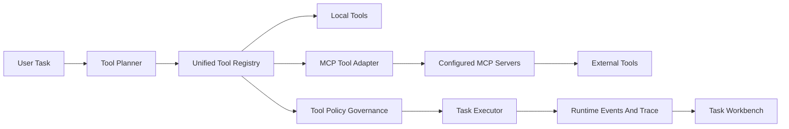

# Phase 5 Plan: MCP Tool Ecosystem And External Integrations

## Purpose

Make MyAI's tool system extensible through a standard protocol, while preserving the governance, observability, retry, trace, and workflow foundations built in Phases 1-4.

Phase 3 made local tools executable and inspectable. Phase 4 made knowledge workflows usable. Phase 5 should let MyAI safely connect to external tools without hardcoding every integration into the Python codebase.

## North Star

MyAI should be able to discover, register, govern, execute, and observe external MCP tools as first-class task tools.

The user should be able to ask for a task, see which external capability will be used, understand why permission is required, and inspect the result in the same task timeline as local tools.

## Current Foundation

Already available:

- `Tool` abstraction with args schema, policy, validation, timeout, retry, and execution result.
- `ToolRegistry` for local Python tools.
- `ToolPlanner` and workflow registry.
- Tool policy metadata and confirmation-required behavior.
- Task runtime events, timelines, background task mode, and task reports.
- Memory, knowledge, and eval tools as local task tools.

Main gap:

- External tool discovery and execution are not standardized.
- Tool adapters are local Python classes only.
- Permissions are static per local tool, not derived from external tool metadata.
- There is no connector health/status surface.

## Architecture Direction

Core principle: MCP tools should look like normal MyAI tools to the planner and executor, but carry enough external metadata for permissions, health checks, and audit.

## Phase 5 Increments

### 5.1 MCP Bridge MVP

Purpose: introduce a minimal internal adapter for external MCP-style tools.

Status: baseline implemented.

Add:

- `MCPToolDescriptor`
- `MCPToolAdapter`
- `MCPServerConfig`
- `MCPToolRegistryLoader`
- local mock MCP server/client for tests

Acceptance criteria:

- MCP descriptors can be converted into existing `Tool` instances.
- Tool args schema, name, description, and policy metadata survive the conversion.
- A mock MCP tool can be executed through the existing `ToolExecutor`.

Recommended scope:

- Do not connect to real external servers yet.
- Use an in-process fake client to stabilize the adapter contract.

Implemented baseline:

- Added MCP bridge primitives:
  - `MCPServerConfig`
  - `MCPToolDescriptor`
  - `MCPToolAdapter`
  - `MCPToolRegistryLoader`
  - `MockMCPClient`
- MCP descriptors now convert into existing MyAI `Tool` instances.
- MCP registry names are namespaced as `mcp__server__tool` to avoid local tool collisions.
- Adapter preserves:
  - tool name
  - description
  - JSON input schema
  - timeout/retry policy
  - risk level
  - confirmation requirement
- Mock MCP tools execute through the existing `ToolExecutor`.
- Existing validation and permission-required paths are reused without special executor logic.
- Added regression coverage for:
  - descriptor-to-tool schema conversion
  - successful mock execution
  - argument validation failure
  - permission-required blocking
  - disabled server exclusion

### 5.2 Unified Tool Registry And Inspection

Purpose: show local and MCP tools through one registry view.

Status: baseline implemented.

Add:

- registry source metadata: `local`, `mcp`
- server id/name for MCP tools
- tool health/status
- `GET /task/tools` Python endpoint
- Java proxy and task/settings UI inspection panel

Acceptance criteria:

- User can inspect available tools.
- MCP tools are visually distinguishable from local tools.
- Tool schemas and permission policies are visible before use.

Implemented baseline:

- Added unified tool inspection payload from `TaskService.list_tools()`.
- Added Python endpoint:
  - `GET /task/tools`
- Added Java proxy endpoint:
  - `GET /task/tools`
- Tool inspection includes:
  - tool name
  - source (`local` or `mcp`)
  - MCP server id and external tool name when applicable
  - description
  - status and health
  - policy metadata
  - input schema
  - required args
  - trigger metadata
- Added frontend task workbench tool directory.
- Frontend tool cards show:
  - local vs MCP source
  - MCP server id
  - risk level
  - confirmation requirement
  - required args
  - raw schema
- Added regression coverage for:
  - local tool API listing
  - MCP tool inspection metadata
  - frontend script syntax

### 5.3 MCP Tool Policy And Permission Mapping

Purpose: prevent external tools from bypassing governance.

Status: baseline implemented.

Add policy mapping from external metadata to MyAI `ToolPolicy`:

- safe/read-only
- network
- filesystem/read
- filesystem/write
- browser/session
- account/action
- destructive
- sensitive

Acceptance criteria:

- Unknown or high-risk MCP tools fail closed or require confirmation.
- Confirmation-required MCP tools produce normal task policy events.
- Policy decisions are visible in the task timeline.

Implemented baseline:

- Added MCP policy mapper:
  - `map_mcp_tool_policy`
- External metadata now maps into MyAI `ToolPolicy` using:
  - descriptor risk fields
  - server defaults
  - `riskLevel` / `risk_level`
  - `readOnlyHint`
  - `destructiveHint`
  - `openWorldHint`
  - capabilities/categories
  - timeout/retry annotations
- Supported mapped risk categories:
  - `safe`
  - `network`
  - `filesystem/read`
  - `filesystem/write`
  - `browser/session`
  - `account/action`
  - `sensitive`
  - `destructive`
  - `unknown`
- Conservative defaults:
  - unknown risk requires confirmation
  - destructive/write/browser risks are blocked in hosted mode
  - destructive/write/account/sensitive risks disable retry
- Tool inspection now exposes `policy_metadata` with mapping source and reason.
- Frontend tool directory now shows policy reason when available.
- Added regression coverage for:
  - read-only mapping
  - network/open-world mapping
  - destructive mapping
  - unknown risk conservative behavior
  - server-level confirmation defaults

### 5.4 MCP Execution Events And Trace

Purpose: make external tool calls observable.

Status: baseline implemented.

Add runtime metadata:

- server id
- external tool name
- request id
- latency
- retry count
- policy decision
- sanitized args
- result size
- error category

Acceptance criteria:

- Task timeline can explain which MCP server/tool was called.
- Failures include actionable recovery recommendations.
- Existing runtime eval can assert MCP events.

Implemented baseline:

- MCP adapter now records actual external call metadata:
  - server id
  - external tool name
  - registry tool name
  - call status
  - started/finished timestamps
  - call latency
  - adapter exception category
- Task runtime now emits MCP-specific events:
  - `task.mcp_call.completed`
  - `task.mcp_call.failed`
- MCP call events are attached to both the run timeline and the owning step event list.
- Frontend task timeline now renders a compact MCP summary for MCP call events.
- Added regression coverage for end-to-end MCP execution trace in `TaskService`.

### 5.5 First Real Connector: Filesystem Read-Only

Purpose: connect one useful low-risk external capability.

Status: baseline implemented.

Candidate:

- read-only filesystem MCP over a sandboxed workspace root

Capabilities:

- list files
- read text file
- search file names
- maybe summarize file through existing task workflow

Acceptance criteria:

- Tool can only access configured roots.
- Attempts outside allowed roots fail closed.
- Task workflow can use the connector without special-case planner logic.

Implemented baseline:

- Added `ReadOnlyFilesystemMCPClient` as the first real MCP-style connector.
- Connector is scoped to configured local roots:
  - default root: repository workspace
  - override: `MYAI_MCP_FILESYSTEM_ROOTS`
  - disable: `MYAI_MCP_FILESYSTEM_ENABLED=false`
- Registered read-only tools into the unified task registry:
  - `mcp__filesystem_readonly__list_files`
  - `mcp__filesystem_readonly__read_text`
  - `mcp__filesystem_readonly__search_names`
- All path requests are resolved and checked against allowed roots before access.
- Escapes outside allowed roots fail closed with `path_outside_allowed_roots`.
- Tools use MCP policy mapping with `filesystem/read`, `readOnlyHint`, and hosted-mode disabled.
- Added regression coverage for list/read/search and path escape rejection.

### 5.6 Connector Settings And Health UI

Purpose: make external integrations manageable by the user.

Status: baseline implemented.

Add:

- connector list
- enabled/disabled flag
- health check
- last error
- risk level summary
- permission default

Acceptance criteria:

- User can see which connectors are enabled.
- User can disable a connector without code changes.
- Health failures are visible without reading logs.

Implemented baseline:

- `ReadOnlyFilesystemMCPClient` now exposes connector inspection metadata:
  - enabled state
  - health status and message
  - configured root names and resolved paths
  - root availability/readability
  - environment variable names for settings
  - risk summary
- `TaskService.list_connectors()` aggregates MCP tools by connector/server id.
- `GET /task/tools` now returns:
  - `summary.connectors`
  - `summary.healthy_connectors`
  - `connectors`
- Frontend task tool directory now renders a connector settings and health section.
- Connector cards show enabled/healthy state, root paths, tool count, risk level, hosted-mode status, and raw connector tools.
- Added regression coverage for connector health/settings payload and task tools API connector summary.

### 5.7 MCP Eval Fixture And Report

Purpose: make connector behavior regression-testable.

Status: baseline implemented.

Add eval cases:

- descriptor load
- schema conversion
- safe tool execution
- permission-required tool blocking
- timeout/retry classification
- connector health failure
- disabled connector

Acceptance criteria:

- MCP report runs locally without real external services.
- Adapter and policy changes can be regression-tested.

Implemented baseline:

- Added MCP eval fixture:
  - `tests/fixtures/mcp_eval.json`
- Added local MCP report runner:
  - `.\\.venv\\Scripts\\python.exe -m app.task.evaluation.mcp_report --format markdown --strict`
- Fixture coverage includes:
  - descriptor registration and schema conversion
  - read-only policy mapping
  - destructive policy hosted-mode blocking
  - connector health/settings inspection
  - successful MCP execution trace
  - filesystem path escape fail-closed behavior
  - disabled connector exclusion
- Report output includes:
  - total/pass/fail/pass rate
  - coverage by case type
  - per-case key result and expectation errors
- Added regression coverage for fixture pass/fail and Markdown rendering.

### 5.8 Workflow Integration

Purpose: let external tools participate in repeatable workflows.

Status: baseline implemented.

Add:

- workflow registry support for MCP-sourced tools
- connector-aware workflow matching
- examples:
  - read project file then summarize
  - inspect directory then create task plan
  - search docs then answer with citations

Acceptance criteria:

- Workflows can require MCP tools by stable capability id.
- Task output still shows full timeline and policy metadata.

Implemented baseline:

- Added MCP-aware argument extraction for filesystem MCP tools:
  - `read_text`
  - `list_files`
  - `search_names`
- Added stable workflow registry entries:
  - `mcp_filesystem_read_summary`
  - `mcp_filesystem_search_plan`
- Workflows require MCP tools by stable registry names:
  - `mcp__filesystem_readonly__read_text`
  - `mcp__filesystem_readonly__search_names`
- Read workflow supports project/local file read and summary-style output.
- Search workflow supports project/local filename search and planning-oriented match output.
- Task execution keeps existing MCP policy metadata and `task.mcp_call.completed` timeline events.
- Added regression coverage for workflow listing, workflow matching, MCP tool args extraction, execution result, and timeline event presence.

### 5.9 Second Real Connector: Git Read-Only

Purpose: add a second practical connector for project/repository work before closing Phase 5.

Status: baseline implemented.

Implemented baseline:

- Added `GitReadOnlyMCPClient`.
- Registered read-only git tools by default:
  - `mcp__git_readonly__status`
  - `mcp__git_readonly__log`
  - `mcp__git_readonly__show`
- Connector settings:
  - default repo root: project workspace
  - override: `MYAI_MCP_GIT_ROOT`
  - disable: `MYAI_MCP_GIT_ENABLED=false`
  - git binary override: `MYAI_MCP_GIT_BIN`
- Connector health checks validate git availability and repository metadata.
- Git tools use read-only subprocess calls with argument lists, not shell strings.
- Added stable workflow registry entries:
  - `mcp_git_status_review`
  - `mcp_git_recent_history`
- MCP eval fixture now covers Git connector health and Git execution trace.
- Added regression coverage for Git connector execution, connector inspection, workflow matching, workflow execution, and task timeline event presence.

## MVP Recommendation

Start with 5.1 MCP Bridge MVP.

Why:

- It is the smallest step that changes the architecture in the right direction.
- It does not require network access or real external credentials.
- It lets the existing `ToolExecutor`, `ToolPolicy`, and task timeline prove they can handle MCP tools.
- It creates a stable seam for future connectors.

MVP implementation target:

- Create an in-process mock MCP client.
- Convert mock descriptors to `Tool` instances.
- Register them in `ToolRegistry`.
- Execute them through existing task executor.
- Add tests for success, validation failure, and permission-required behavior.

## Engineering Principles

- External tools must never bypass `ToolPolicy`.
- Unknown risk defaults to confirmation or blocked behavior.
- Tool arguments and outputs should be structured, not string-only.
- Connector failures should be normal task failures with recovery guidance.
- Real external connectors should start read-only before write/action tools.
- Avoid coupling MCP directly to chat; route through task/runtime first.

## Open Questions

- Should connector configuration live in `.env`, JSON settings, or SQLite-backed user settings?
- Should MCP servers be per-user, per-system, or both?
- How much of MCP discovery should happen at startup vs on demand?
- Should Java own connector enable/disable UI, while Python owns runtime config?
- Which real connector should follow filesystem read-only: browser, GitHub, calendar, database, or local shell?
